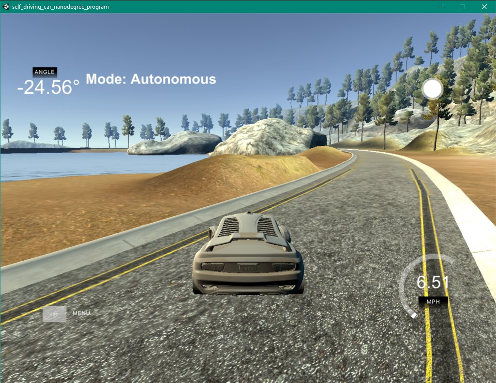
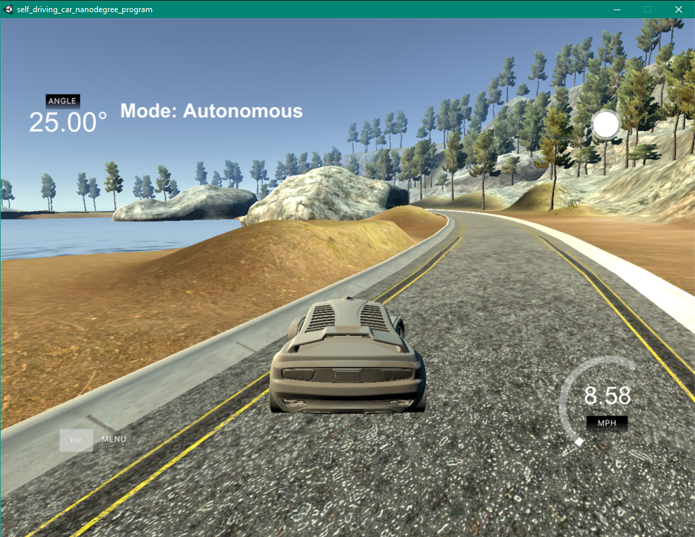
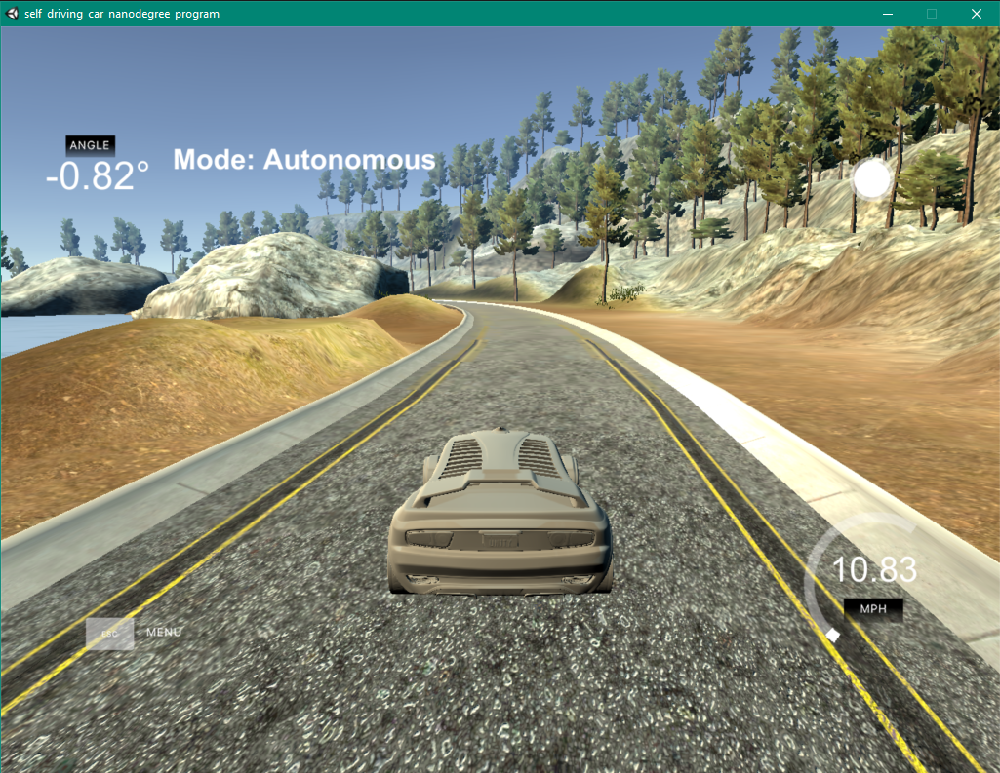

# PID Control System Project

The goal for this project is to:
* create PID controller for steering wheel
* implement the controller
* tune the Kp, Ki, and Kd parameter until the car always stay inside the lane

## Tuning Strategy

The tuning is done manually. First, I think about what each gain in the PID do.
* Proportional Gain is equal to the current error. Ki will adjust the steering so it's proportional to the error.
* Integral Gain is the sum of all the previous error. Ki will try to minimize the long term error.
* Derivative control use the change from previous error. Kd will prevent oscillating and response time.

Therefore, I set the value of Kp, Ki, and Kd to 10, 5, 20.
However, because the cross track error could have value from -12 to 12 and the steering angle should be between -1 and 1, it cause the car to steer too much go out of lane and wasn't to come back fast enough.

Later, I set the limit for the steering angle as wel as lower the parameter down to be around 1. The parameters Kp, Kd, Ki are now 0.2, 0.1, 1. This lower the steering value and keep it in track longer. However, car oscillate too much and the oscillation keep increasing. 

Therefore, I have to lower the Kd value and increase the Ki value to keep it around center.

This time the car work farely well and keep inself inside the lane. It osciallate occasionally, but would go back to center.

## Discussion

I could try using other algorithm like Twiddle to help tune the parameter. Also, I could tune other parameter such as speed to help make the transition smoother. 